## Overview
======

Illumination prediction is a crucial component for augmented reality (AR) and mixed reality (MR) to produce virtual objects emulating optical physics. It is challenging to predict a mapping from a partial scene application to a complete illumination map for a scene. This is because a lot of the illumination in many scenes are incomplete, and it is difficult to infer from partial data.

Illumination prediction is important because it can be used to render images in augmented reality or create realistic shadow and lighting models of virtual objects in movies. It can also render models of houses to attempt to accurately portray real illumination physics.

Because humans do not need much image resolution to figure out a light source, we would like to solve illumination problems with low-resolution images.

The purpose of the proposal is simple: to estimate lighting information on Augmented Reality Devices. 

The first part utilizes a pretrained network and then the second part uses a Blender to make real-time predictions possible. There is a preprocessing step where each image resolution is reduced, and an algorithm finds the connected components of light pixels.

We trained this set using a convolutional neural network. Finally, we convert the light coordinates into spherical coordinates, and render the panorama images.

## State-of-Art

Researchers performed multiple illumination prediction experiments in the past. One way that some researchers from Universite Laval discovered was to represent lighting as a set of 3D Lights with brightness and geometric parameters, and train this through deep neural networks, using a dataset of environment maps. A unique set of differentiable layers generates a unique sigmoid function to evaluate the work, leading to more accurate results.

There was also a study that inferred a high-level illumination prediction from a low-level dynamic range photograph. Researchers trained to annotate light sources, and these annotations are used to train a deep neural network, and the network is fine tuned.

A third experiment involved trying to infer a high dynamic range result (HDR) from a low dynamic range image with a mobile phone camera using a limited Field of View (FOV). Videos were collected with lighting using reflective spheres, and the researchers train a deep neural network to predict what the reflective spheres will appear upon being reflected on an unknown surface. 

## Our Approach

  - Estimate the lighting conditions at the camera's location from a single image 
  - Assume the lighting condition of the object is the same or very similar to the camera. No additional information about the geometry, occlusion other than a ground plane is needed
  - Deep learning based
  - Simplified parametric estimation

  Our source code is [here](https://github.com/xiaoxi-s/Illumination-Prediction.git)

### Network Architecture

  The feature extractor is [dense121](https://arxiv.org/abs/1608.06993). The classification layer is replaced with two linear layers with a Relu activation between them. The output of the naive JPG model is different from that of the EXR model. The JPG model assumes there are three light sources in the environment map of an input image where each is specified by 8 parameters. Because of the improved labeler, which we would describe below, the EXR model assumes there are six light sources where each is specified by five parameters. 

### Dataset

  We are using the [The Laval HDR databases](http://indoor.hdrdb.com/). It contains 2100+ high resolution indoor panoramas. Each panorama has the resolution of 3884x7768. The total size of the dataset is over 150 GB. Here are some examples: (Tone-mapped back gamma color space, 8 bit color)

  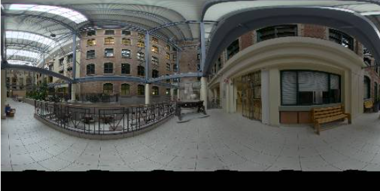
  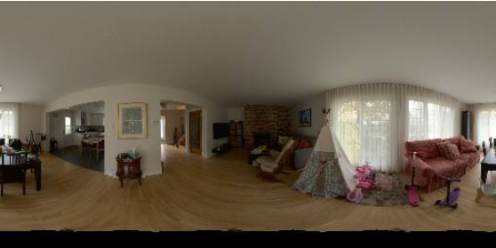

### Labeling process

  This preprocess stage's primary goal is to develop a realistic representation of lights coming to the camera. The representation will be used to render inserted objects. Though we have the environment map as a potential light source, it is impossible to use it in real time render engines. Therefore, we use directional light, point light, or area light, which are accepted by most of the engines. We first developed a naive translation between map and lights based on the original paper. Then we improve the labeling process by only use directional and point light.

  **We will illustrate the labeling process by this example**
  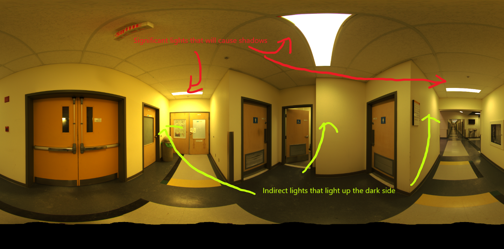
 
#### Naive approach using JPG Environment map/(uint8)

  - The brightest parts in the environment map are usually the most significant light sources when rendering virtual objects. We use a simple threshold method to find them. The extreme intensity is defined as the maximum pixel value after summing up the values along the channel axis. We extract the maximum value in the environment map and set the threshold at 10%. Any parts above that are considered as "bright enough." Here are the significant parts in this map

  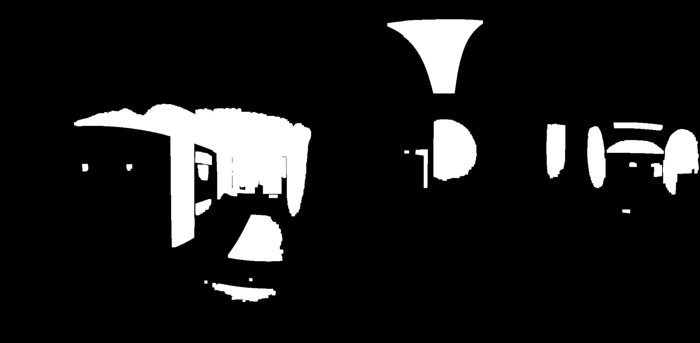
  - Then we find the connected component in this map. We use `measure.label()` in OpenCV and sort them based on their size and brightness. If a component is smaller than 300 pixels, it will be discarded. Here are some parts we extracted.

  Strongest | Largest
  --|--
   | 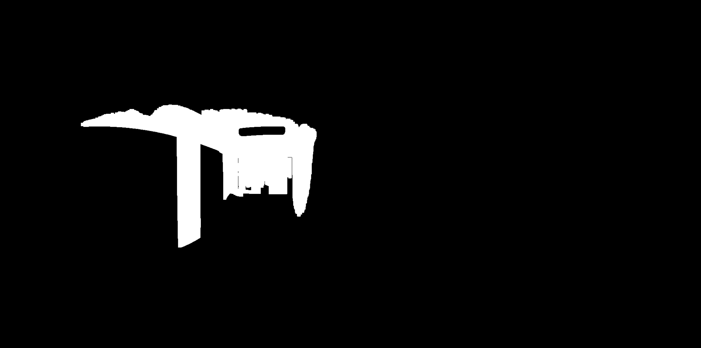

  - Our algorithm would draw a minimum area rectangle that surrounds each light source in the final step. The parameters defining the minimum area rectangle would also define the parameters for an ellipse. We would use the parameters as the label for each light source. 
  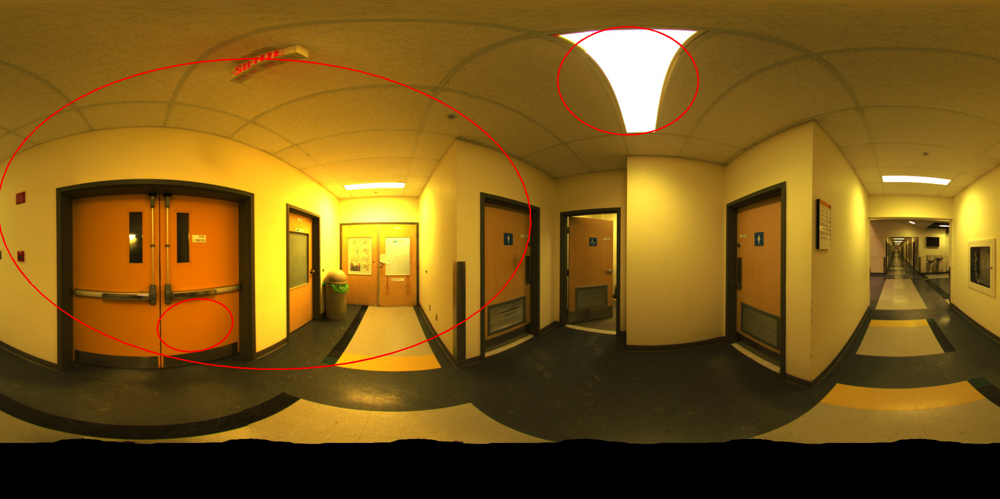

  - Evaluation: 

     We rendered a chair using this environment map as a light source in Blender as our ground truth. It is generated using the path trace algorithm and takes 2 minutes to render. 

    Ground Truth | Naive Approach
    ------------ | ------------- 
    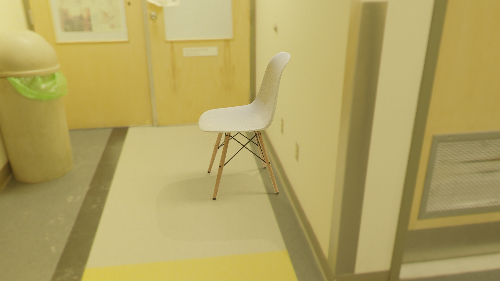 | 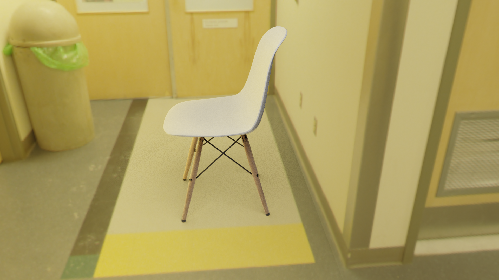

    we think this result have several artifacts 
    1. One of the considerable contributors to realism is shadows. We can observe the chair's shadows in the ground truth, but there is only a little shadow very close to the leg. As a comparison, the shadow of the rubbish bin is obvious and contribute a lot to the realistic look of that object
    2. Too much information is lost when using the Uint8 representation. Many bright lights saturated at their maximum value, so we cannot compare which light is more luminous. Moreover, the color of the lights is lost during the conversion. For example, we can see the orange light on the leg, coming from the orange door on the left. The intensity of this light is surely less than the intensity of the lights at the ceiling. However, they are saturated at the maximum brightness (255), and the comparison yields wrong results.
    3. The rendering cannot be done in real-time. Area lights need to be baked in most of the render engines. So we cannot use it in real-time AR applications. 
    4. The bright part of this render is too bright, and the dark part is too dark. The surface of the chair loses all information about its geometry. On the contrary, the junction between the chair body and the legs are too dark. 
    5. Subjectively, we don't think this is great. We sent this image to some of our friends and asked them to rate the realism. Most of them rated it as "it looks fake but acceptable." On the other hand, all of them rate the ground truth better than the rendered result using the naive approach. 

#### Advanced approach

  With all the artifacts in our naive approach, we looked for a new labeler and probably new types of lights. we took a closer look at our datasets and found two key observations 
  1. The number of visible shadows of an object usually is not more than 5. Since more distant lights are less significant and will cause shallow shadows. Also, they are closer together in the object's perspective. Our brain will try to merge these shadows rather than distinguish them. Therefore using a few directional lights can capture the strongest and closest lights and generate the visible shadows
  2. The darker side of any object is not entirely dark. Various indirect lights (such as reflections from the wall) will light them up. These lights are typically large and in the opposite direction of the strongest lights. Using point lights can capture these effects well.
   
  With those in mind, we created a new labeler. This labeler will use Exr files(float32) to capture the HDR information in the environment map. It will find three directional lights and 3 point lights with different criteria.

##### Steps

  - Create the significance map with brightness thresholds. The high threshold can capture the lights that cause shadows. The Lower threshold can capture indirect lights. The pixels in the high threshold map will be removed from the low threshold map.

  High Threshold | Low Threshold |Low Threshold map - High Threshold map
  ------------ | -------------| -------------
  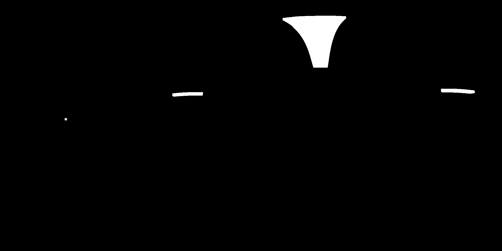 |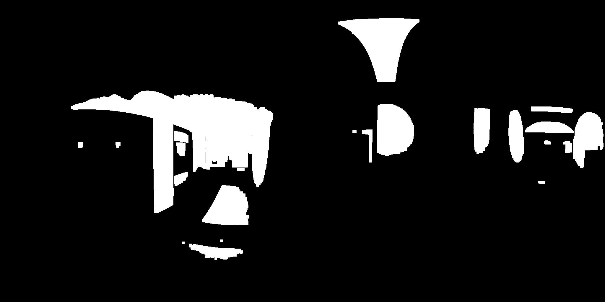 | 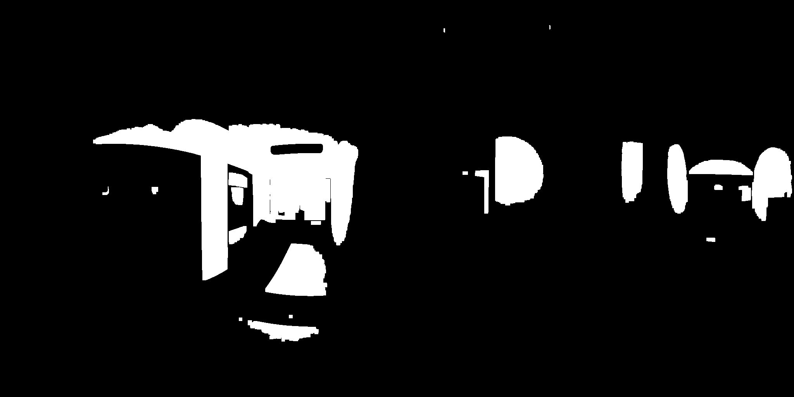 

  - Similar way of finding connected components is used. However, there is no size requirement for directional lights. A header LED light might appears to be very small in the environment map. There is a minimum size requirement for the indirect lights to be significant
  - Adjust the threshold to find precisely three significant light and three indirect lights

  High Threshold Last iteration| Low Threshold Last iteration| Adjusted Low Threshold Map Last iteration
  ------------ | -------------| -------------
   |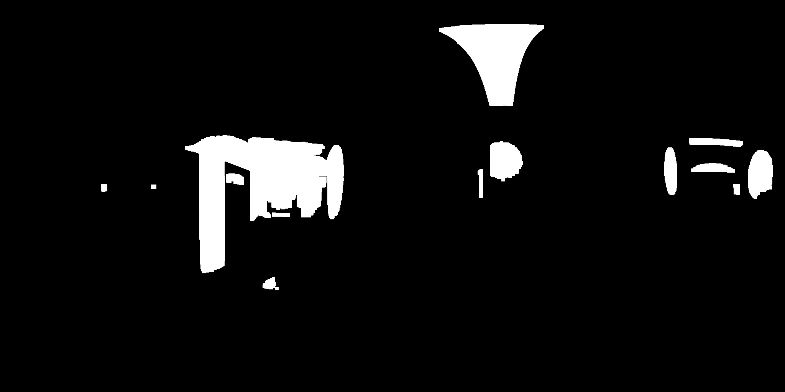 | 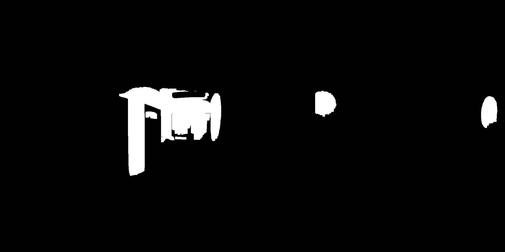 

  - Averages of these pixels are calculated in spherical coordinates. The color of the light is the average of all the pixels

#### Results

  Ground Truth | Naive Approach | Advanced Approach
  ------------ | ------------- | ------------- 
   | | 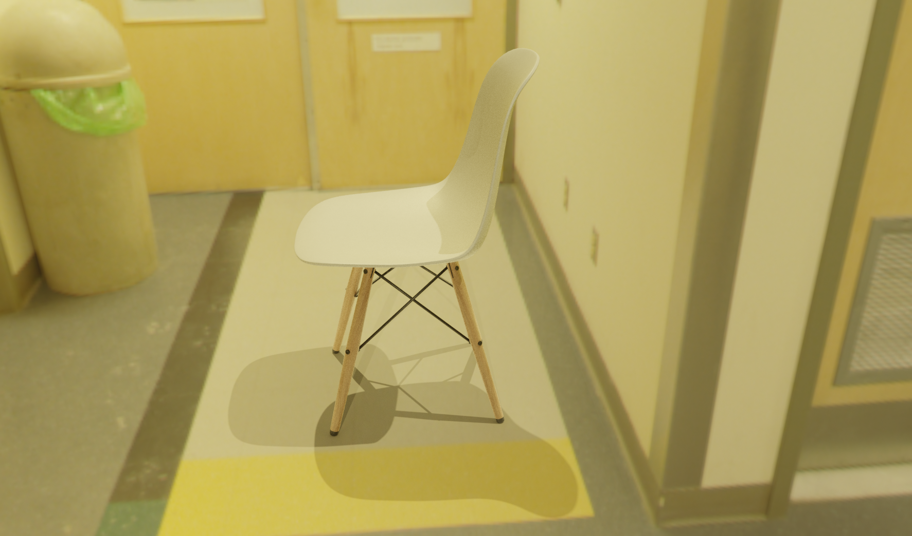 

  We believed that this is an acceptable approximation of the lighting condition in the environment. Using Exr and HDR images can preserve more accurate light information and find the brightest light correctly.  The chair's color is very similar, comparing with ground truth. The self-shadow on the back of the chair is preserved. No parts on the chair are too dark or too bright. More importantly, this is rendered in real-time.

  The positions of the shadows in our labeled result align with the shadows in the ground truth. However, due to the render engine's limitation, we cannot produce realistic soft shadows in real-time. The hard shadow is a compromise we made to reach real-time relighting. Though our approach is not as convincing as the ground truth, it increases the inserted object's realistic look by a large margin.

### Data Generation

#### Cropping

  Our goal is predicting the scene's illumination from a single image, so we need to generate a normal image from the environment map. We used a very simple algorithm to take a picture in the environment map. 
  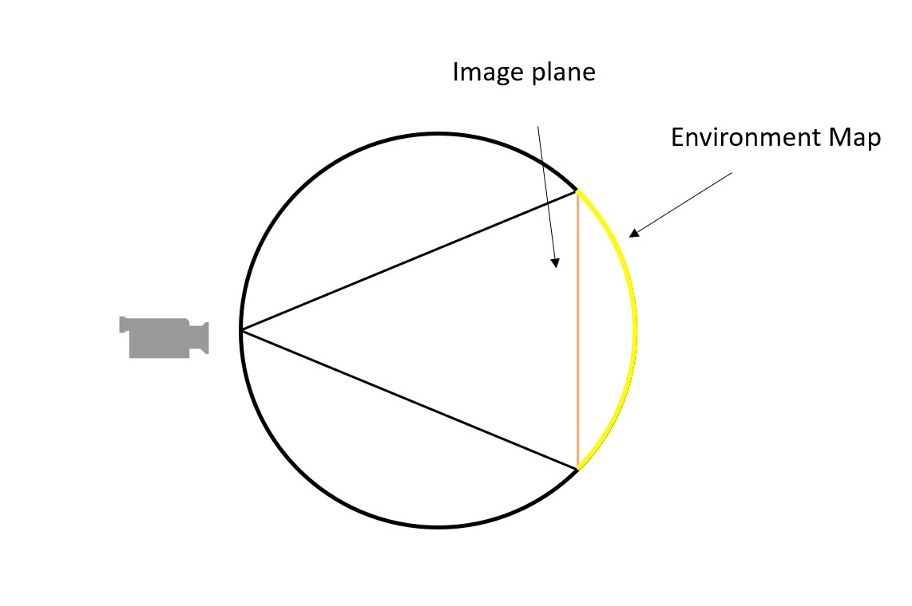
  Here are some examples from our cropper
  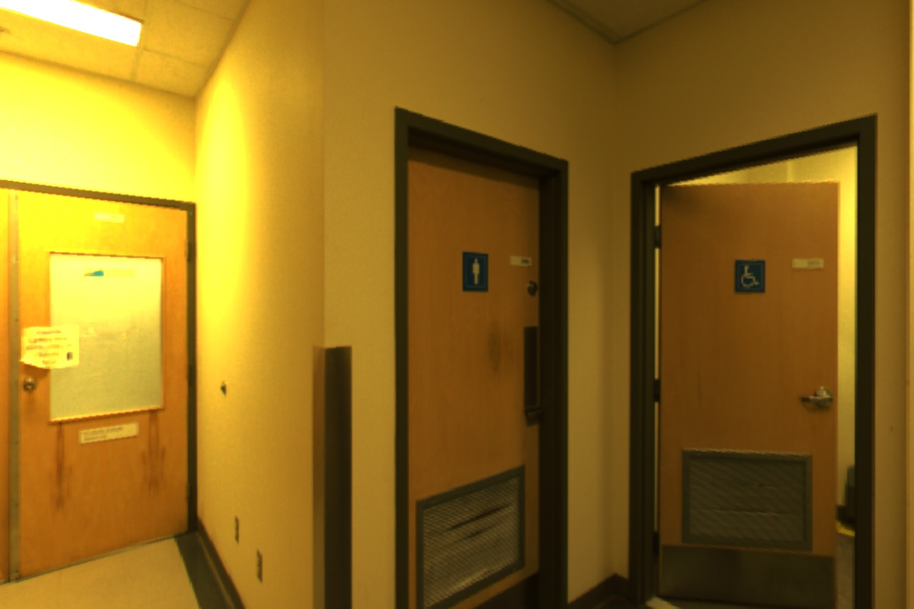 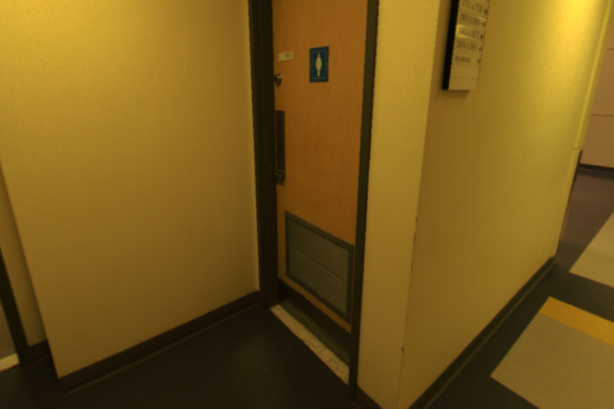

#### Labels rotation

  To prevent the orientation of the camera affecting the result, we translate all labels into the camera's coordinate. 

#### Examples

  Here are some rendering examples from the data we used for training

  Rendering setup.
  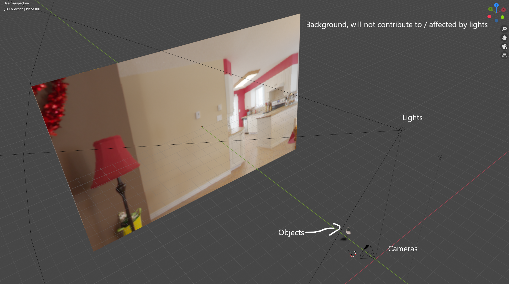

  Examples - Classroom | Examples - Home
  ------------ | -------------
  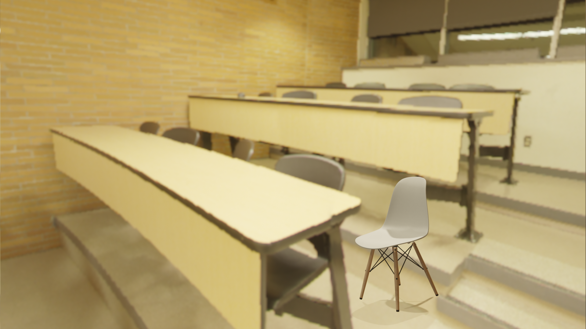|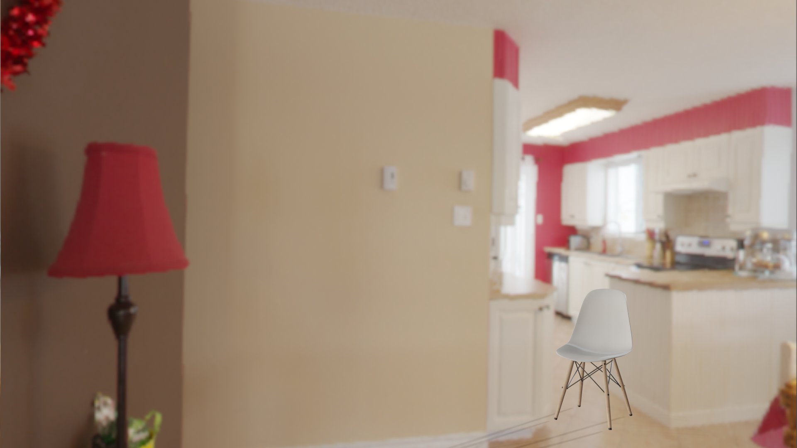
  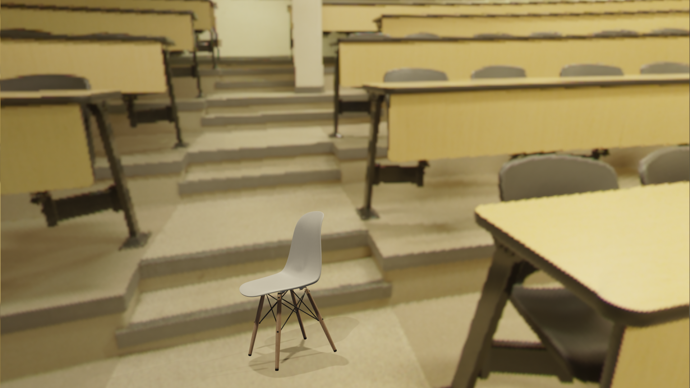|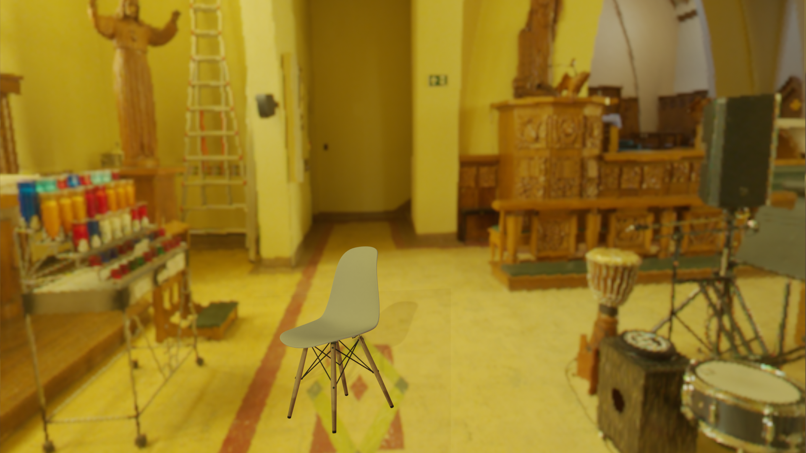

 
### Post-Processing

  In our assumption, we stated that we assume the camera's lighting condition should be very similar or the same as our virtual object. However, this assumption is highly possible to be violated. We have to insert the items in front of the camera, and the environment maps are taken in a relatively small room. Therefore objects slightly in front of the camera would possibly have a noticeable change in lighting conditions. On the other hand, 99% of our dataset's lights and real-life are at the ceiling.  We created a simple rotation mechanism to alleviate this issue: it will rotate all the lights upwards to approximate the distance between the camera and the object.

  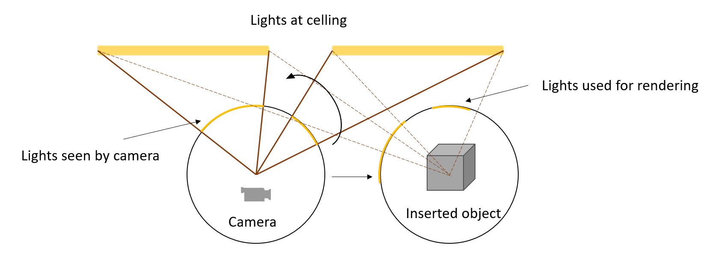

  From this example, The lighting angle at the camera's position is very different from the object's position, and our assumption does not hold. With the rotation, the rendered result would be much more accurate. 

### Training and Approaches to Improve performance

  We provide training details at the end of this website. 

  The approaches we have tried to improve the performance of our model are listed in the following. We would discuss loss function in more detail and provide a short description of the results of other approaches.

  - Loss function: Use cosine loss function for spherical coordinate prediction instead of l2 norm. 
  - Use different weights for location and RGB value. However, the range of the RGB values in EXR files is small; this method shows no improvement in overall performance. 
  - Scale the image intensities of the EXR files. 
  - Try different input size: (360, 540) & (240, 480). With input size of (360, 540), our model shows a slightly better performance. 
  - Fine tune the feature extractor. This leads to overfitting. 

### Evaluation

  In general, accuracy for lighting evaluation can be tricky to evaluate. We use L2 distances with a predefined threshold to evaluate our model quantitatively. In particular, the location and the RGB value of a given light source are evaluated separately with their corresponding thresholds. However, as threshold based methods are limited to the choice of thresholds, we provide sensitivity analysis for our EXR model to determine the effects of different thresholds. 

### Sensitivity Analysis for the EXR model
  
  The sensitivity analysis includes the following steps:

  - Determine a step size and a "reasonable" range of the parameter, in this case, the threshold for counting accuracy. 
  - Quantize the range with the step size to generate a sequence of thresholds. 
  - Evaluate the performance given each threshold in the sequence.
  - Normalize two sequences of thresholds (one for location accuracy, the other for color accuracy) to the range (0, 1] by dividing the maximum of the parameter. 
  - Plot the figure of normalized thresholds vs. accuracy.

  As the label of location for EXR samples are angles, we choose the range to be \[pi/18, 3.20\]. For RGB values of EXR files, as the range is between [0, 1], we set the threshold to be within \[0.001, 1.2\]. The choice of the largest thresholds can be justified as follows. The key idea is to choose them to be the worst case. Notice that we did not use cosine loss function to train the network for location (coordinate) prediction. Therefore, the range for coordinates is fixed. In particular, the horizontal angle is in the range \[0, 2pi\]. and the vertical angle is in the range \[0, pi\]. For location prediction, as the system is spherical, the worst average difference between prediction and the ground truth is pi, which means the predicted coordinate is at the opposite direction to the ground truth. Thus, we choose the threshold to be slightly higher than pi. For RGB value prediction, EXR files have RGB values between \[0, 1\]. Then, the worst average difference is 1. Again, we choose a slightly higher value 1.2. 

## Result

  In this section, we would provide the results of the evaluation of both the JPG and EXR model, and rendering examples. 

### Accuracy of the JPG Model

  Our JPG model achieves around 18% accuracy when predicting the location of the light source given a threshold of 100 pixel distance. For predicting the RGB value, our JPG model achieves 85% accuracy given that the l2 norm of the predicted RGB value must be less than 100. The figure below shows the performance on the test set. 

  

  
  
  
  

   

  The model reference is [here](https://github.com/xiaoxi-s/Illumination-Prediction/blob/main/checkpoint/model_epoch_50).

#### Sensitivity Analysis for EXR model
  The result is shown in the figure below. 

  

  
  

  As the threshold increases, which means the tolerance level increases, the accuracy also increases. In addition, the EXR model predicts color more accurately than position because given the reasonable range of thresholds, color accuracy is greater than location accuracy.

  The model reference is [here](https://github.com/xiaoxi-s/Illumination-Prediction/blob/main/checkpoint/model_epoch_30_res_540x360).

### Rendering Examples

  With Labels | With Predicted Outputs
  ------------ | -------------
  |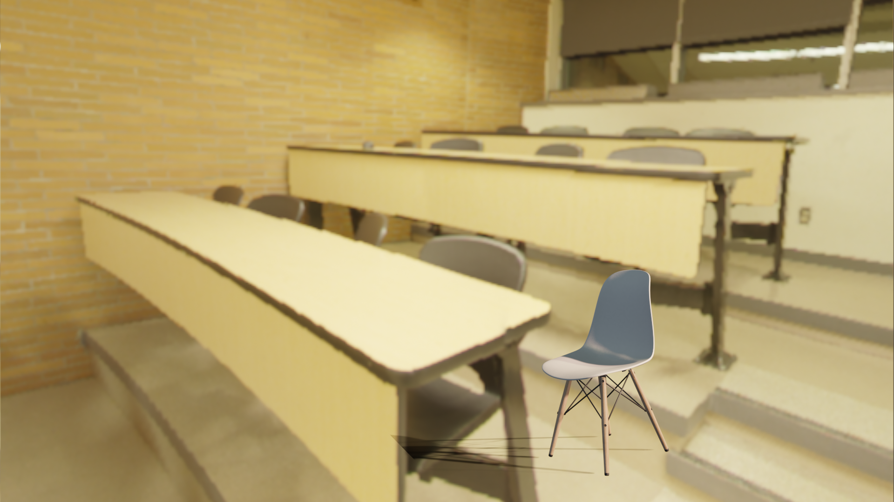
  |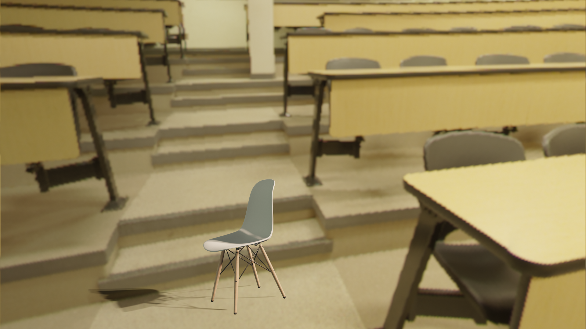
  |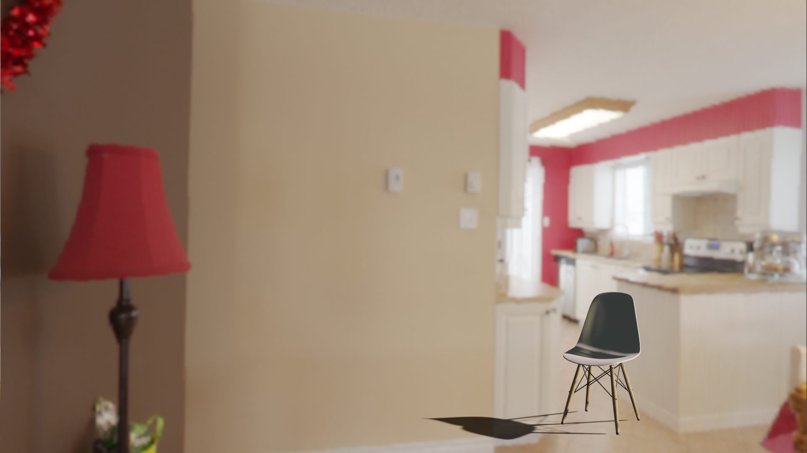
  |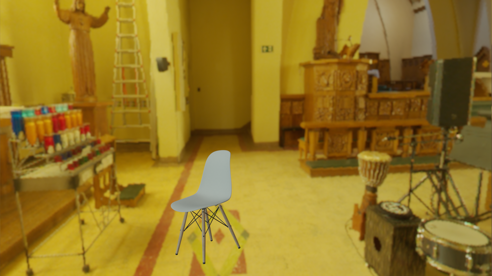

## Discussion

### Loss Function for Coordinate Prediction

  Cosine loss function could be used for spherical coordinate prediction of a light source. Nevertheless, this does not give us better performance. One possible explanation is that, with cosine loss function, there are infinitely many correct labels that the network could map a given input image to. It would be much more difficult for the neural network to learn infinitely many correct labels with only finitely many parameters. 

  In addition, even with cosine function, the model could predict one correct label in the range \[100pi, 102pi\], and other labels might be within \[0, 2pi\]. The parameters for predicting the special label that lies in [100pi, 102pi] might not be used for predicting other labels within \[0, 2pi\] because the interval \[100pi, 102pi\] is larger in scale. Therefore, cosine loss function might deteriorate parameters sharing.

### Sensitivity Analysis

  Sensitivity analysis is an effective method to evaluate threshold based methods. The better performance of color prediction might imply that the feature extractor pays more attention to color information. The [dense121](https://arxiv.org/abs/1608.06993) is trained for classification, thus color information is an important feature of a particular object or pattern. The feature extractor would try to capture color information to imporve classification performance. However, the location information of a particular object or pattern, which is needed in our project, might not be extracted probably because location information is less important for classification tasks. For example, a cat is a cat no matter where it is in the given image. That is, the location information does not provide much information for classification. 

  Therefore, the above explanation implies a given pre-trained model might not encode necessary information of other tasks, and more (accurate) samples might be needed to fine tune the pre-trained model. 

### Thoughts about Performance

  We think there are reasons for the unideal predictions of our EXR model. 

  - The distribution of the dataset might not match the distribution expected by the feature extractor. The range of RGB values of EXR files is between \[0, 1\] and many values are within the range [0, 0.01]. As we want to preserve the information in EXR files, we have to manually scaling the input by a constant factor. Simple [normalization](https://pytorch.org/docs/stable/torchvision/transforms.html) implemented in PyTorch does not meet our need, and our transformation does not produce better results. 
  - The EXR files are compressed to increase the training speed. The original resolution is 3884x7768. We resize it to be 1024x2048. Such conversion might lead to less detailed information, thus the performance.

### Feature Extractor

  Although this project is not aimmed at testing different feature extractors, we tried another feature extractor, [wide residual network 50-2 (WRN)](https://arxiv.org/pdf/1605.07146.pdf). However, WRN is more computationally expensive (takes much longer to train) and yields much worse result than dense net. Therefore, we eventually stick to our initial choice. 

### Rendered Results

  The predicted colors matches the color in ground truth image. However, the position/rotation of the lights are not very accurate. An interesting observation is location prediction results are very similar to each other. We suspect the order of the lights affected the accuracy of the model. 
 
### Intensity of lights 

  Every rendering engine uses a different scale for the intensity of lights. Similarly, the intensity in the HDR image cannot be simply converted to the intensity of lights in Blender. Therefore, we can only extract the relative light information in the environment map. 

### Geometry and occlusion in the scene
  
  We only assume a ground plane, and this is the only geometry our object will interact with. The real world is much more complicated than this simple model. However, We kept our scope in only estimating lighting conditions at the camera's location, and our result can be used in conjunction with other AR software to predict the geometer, etc. We believe it will yield better results after combining scenes information

## Material
  - [Project Proposal](material\Final-Project-Proposal.pdf)
  - [Midterm Report](material\midterm-report.pdf)

## References

  - Marc-André Gardner, Kalyan Sunkavalli, Ersin Yumer, Xiaohui Shen, Emiliano Gambaretto, Christian Gagné, and Jean-François Lalonde Learning to Predict Indoor Illumination from a Single Image ACM Transactions on Graphics (SIGGRAPH Asia), 9(4), 2017
  - Gardner, Marc-André, et al. Deep Parametric Indoor Lighting Estimation. arXiv:1910.08812 \[cs\], 2019, Oct. arXiv.org, http://arxiv.org/abs/1910.08812.
  - Chloe LeGendre, Wan-Chun Ma, Graham Fyffe, John Flyn, Laurent Charbonnel, Jay Busch, and Paul Debevec DeepLight: Learning Illumination for Unconstrained Mobile Mixed Reality (CVPR_2019), 2019 
	https://openaccess.thecvf.com/content_CVPR_2019/papers/LeGendre_DeepLight_Learning_Illumination_for_Unconstrained_Mobile_Mixed_Reality_CVPR_2019_paper.pdf

## Training Details

### Dependencies

  - Conda
  - Python3.7
  - PyTorch
  - Numpy
  - OpenCv

### Hyperparameters

 - Optimizer: [SGD](https://pytorch.org/docs/stable/optim.html?highlight=sgd#torch.optim.SGD)
 - Learning rate: 0.001
 - Momentum: 0.9
 - Batch size: 16 
 - Model type: float

### Time

 - Time for training with fine tune: 6.4 min/epoch
 - Time for training without fine tune: 2.7 min/epoch
