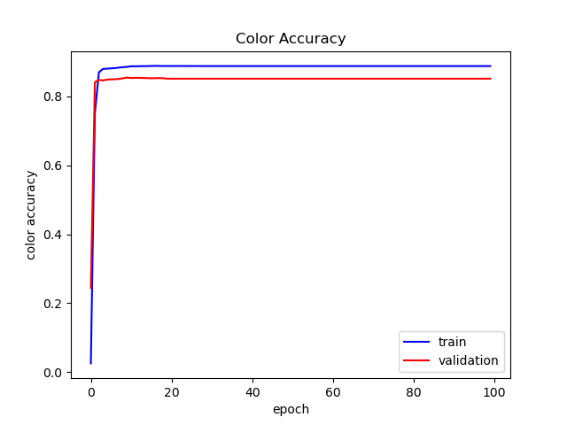
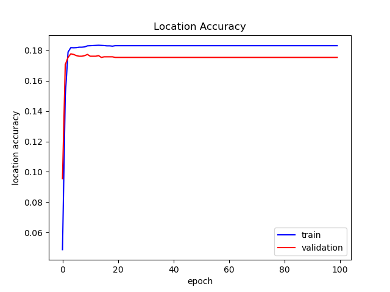

## Overview
======

  Illumination prediction is a crutial component for augmented reality (AR) and mixed reality (MR) to produce expected virtual objects and scenes. 

  - Importance, application
  - complexity

## State-of-Art

## Our Approach

  - Deep learning based
  - Simplified parametric estimation

  Our source code is [here](https://github.com/xiaoxi-s/Illumination-Prediction.git)

### Network Architecture

  The feature extractor is [dense121](https://arxiv.org/abs/1608.06993). The classification layer is replaced with two linear layers with a Relu activation between them. The output of the naive JPG model is different from that of the EXR model. The JPG model assumes there are three light sources in the environment map of an input image where each is specified by 8 parameters. Because of the improved labeler, which we would describe below, the EXR model assumes there are six light sources where each is specified by five parameters. 

### Dataset

  We use [the Laval Indoor HDR Dataset](http://indoor.hdrdb.com/). The dataset contains over 2100+ high resolution indoor panoramas.

### Preprocess

  Labeling process

### Training and Approaches to Improve performance

  We provide training details at the end of this website. 

  The approaches we have tried to improve the performance of our model are listed in the following. We would discuss loss function in more detail and provide a short description of the results of other approaches.

  - Loss function: Use cosine loss function for spherical coordinate prediction instead of l2 norm. 
  - Use different weights for location and RGB value. However, the range of the RGB values in EXR files is small; this method shows no improvement in overall performance. 
  - Scale the image intensities of the EXR files. 
  - Try different input size: (360, 540) & (240, 480). With input size of (360, 540), our model shows a slightly better performance. 
  - Fine tune the feature extractor. This leads to overfitting. 

### Evaluation

  In general, accuracy for lighting evaluation can be tricky to evaluate. We use L2 distances with a predefined threshold to evaluate our model quantitatively. In particular, the location and the RGB value of a given light source are evaluated separately with their corresponding thresholds. However, as threshold based methods are limited to the choice of thresholds, we provide sensitivity analysis for our EXR model to determine the effects of different thresholds. 

### Sensitivity Analysis for the EXR model
  
  The sensitivity analysis includes the following steps:

  - Determine a step size and a "reasonable" range of the parameter, in this case, the threshold for counting accuracy. 
  - Quantize the range with the step size to generate a sequence of thresholds. 
  - Evaluate the performance given each threshold in the sequence.
  - Normalize two sequences of thresholds (one for location accuracy, the other for color accuracy) to the range (0, 1] by dividing the maximum of the parameter. 
  - Plot the figure of normalized thresholds vs. accuracy.

  As the label of location for EXR samples are angles, we choose the range to be \[pi/18, 3.20\]. For RGB values of EXR files, as the range is between [0, 1], we set the threshold to be within \[0.001, 1.2\]. The choice of the largest thresholds can be justified as follows. The key idea is to choose them to be the worst case. Notice that we did not use cosine loss function to train the network for location (coordinate) prediction. Therefore, the range for coordinates is fixed. In particular, the horizontal angle is in the range \[0, 2pi\]. and the vertical angle is in the range \[0, pi\]. For location prediction, as the system is spherical, the worst average difference between prediction and the ground truth is pi, which means the predicted coordinate is at the opposite direction to the ground truth. Thus, we choose the threshold to be slightly higher than pi. For RGB value prediction, EXR files have RGB values between \[0, 1\]. Then, the worst average difference is 1. Again, we choose a slightly higher value 1.2. 

## Result

  In this section, we would provide the results of the preprocessing, evaluation of both the JPG and EXR model, and rendering examples. 

### Labeler


### Accuracy of the JPG Model

  Our JPG model achieves around 18% accuracy when predicting the location of the light source given a threshold of 100 pixel distance. For predicting the RGB value, our JPG model achieves 85% accuracy given that the l2 norm of the predicted RGB value must be less than 100. The figure below shows the performance on the test set. 

  <p align="center">
  
  
  
  </p>
  <br>

The model reference is [here]()

#### Sensitivity Analysis for EXR model
  The result is shown in the figure below. 

  <p align="center">
  
  </p>

  As the threshold increases, which means the tolerance level increases, the accuracy also increases. In addition, the EXR model predicts color more accurately than position because given the reasonable range of thresholds, color accuracy is greater than location accuracy.

  The model reference is [here](https://github.com/xiaoxi-s/Illumination-Prediction).

### Rendering Examples


## Discussion

### Loss Function for Coordinate Prediction

  Cosine loss function could be used for spherical coordinate prediction of a light source. Nevertheless, this does not give us better performance. One possible explanation is that, with cosine loss function, there are infinitely many correct labels that the network could map a given input image to. It would be much more difficult for the neural network to learn infinitely many correct labels with only finitely many parameters. 

  In addition, even with cosine function, the model could predict one correct label in the range \[100pi, 102pi\], and other labels might be within \[0, 2pi\]. The parameters for predicting the special label that lies in [100pi, 102pi] might not be used for predicting other labels within \[0, 2pi\] because the interval \[100pi, 102pi\] is larger in scale. Therefore, cosine loss function might deteriorate parameters sharing.

### Sensitivity Analysis

  Sensitivity analysis is an effective method to evaluate threshold based methods. The better performance of color prediction might imply that the feature extractor pays more attention to color information. The [dense121](https://arxiv.org/abs/1608.06993) is trained for classification, thus color information is an important feature of a particular object or pattern. The feature extractor would try to capture color information to imporve classification performance. However, the location information of a particular object or pattern, which is needed in our project, might not be extracted probably because location information is less important for classification tasks. For example, a cat is a cat no matter where it is in the given image. That is, the location information does not provide much information for classification. 

  Therefore, the above explanation implies a given pre-trained model might not encode necessary information of other tasks, and more (accurate) samples might be needed to fine tune the pre-trained model. 

### Feature Extractor

  Although this project is not aimmed at testing different feature extractors, we tried another feature extractor, [wide residual network 50-2 (WRN)](https://arxiv.org/pdf/1605.07146.pdf). However, WRN is more computationally expensive (takes much longer to train) and yields much worse result than dense net. Therefore, we eventually stick to our initial choice. 

### Thoughts about Performance

  We think there are reasons for the unideal predictions of our EXR model. 

  - The distribution of the dataset might not match the distribution expected by the feature extractor. The range of RGB values of EXR files is between \[0, 1\] and many values are within the range [0, 0.01]. As we want to preserve the information in EXR files, we have to manually scaling the input by a constant factor. Simple [normalization](https://pytorch.org/docs/stable/torchvision/transforms.html) implemented in PyTorch does not meet our need, and our transformation does not produce better results. 
  - The EXR files are compressed to increase the training speed. The initial resolution is 3884x7768. We resize it to be 1024x2048. Such conversion might lead to less detailed information, thus the performance.

## What We Learned

  - Large dataset is challenging.
  - ...

## Material
  - [Project Proposal]()
  - [Midterm Report](material\midterm-report.pdf)

## Reference

  - Marc-André Gardner, Kalyan Sunkavalli, Ersin Yumer, Xiaohui Shen, Emiliano Gambaretto, Christian Gagné, and Jean-François Lalonde Learning to Predict Indoor Illumination from a Single Image ACM Transactions on Graphics (SIGGRAPH Asia), 9(4), 2017
  - Gardner, Marc-André, et al. Deep Parametric Indoor Lighting Estimation. arXiv:1910.08812 \[cs\], 2019, Oct. arXiv.org, http://arxiv.org/abs/1910.08812.

## Training Details

### Environment Specification

Dependencies: 
  - Conda
  - Python3.7
  - PyTorch
  - Numpy
  - OpenCv

## Parameter Setting

 - Optimizer: [SGD](https://pytorch.org/docs/stable/optim.html?highlight=sgd#torch.optim.SGD)
 - Learning rate: 0.001
 - Momentum: 0.9
 - Batch size: 16 
 - Model type: float

### Cost

 - Time for training with fine tune: 6.4 min/epoch
 - Time for training without fine tune: 2.7 min/epoch

# Welcome to GitHub Pages

You can use the [editor on GitHub](https://github.com/xiaoxi-s/xiaoxi-s.github.io/edit/main/index.md) to maintain and preview the content for your website in Markdown files.

Whenever you commit to this repository, GitHub Pages will run [Jekyll](https://jekyllrb.com/) to rebuild the pages in your site, from the content in your Markdown files.

### Markdown

Markdown is a lightweight and easy-to-use syntax for styling your writing. It includes conventions for

```markdown
Syntax highlighted code block

# Header 1
## Header 2
### Header 3

- Bulleted
- List

1. Numbered
2. List

**Bold** and _Italic_ and `Code` text

[Link](url) and 
```

For more details see [GitHub Flavored Markdown](https://guides.github.com/features/mastering-markdown/).

### Jekyll Themes

Your Pages site will use the layout and styles from the Jekyll theme you have selected in your [repository settings](https://github.com/xiaoxi-s/xiaoxi-s.github.io/settings). The name of this theme is saved in the Jekyll `_config.yml` configuration file.

### Support or Contact

Having trouble with Pages? Check out our [documentation](https://docs.github.com/categories/github-pages-basics/) or [contact support](https://github.com/contact) and we’ll help you sort it out.
